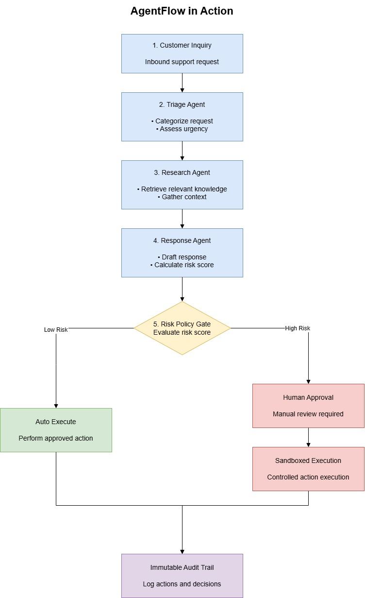

# AgentFlow — AI Multi-Agent Business Automation Platform

> **A controlled enterprise AI workflow automation platform featuring specialized agent pipelines, tool permission sandboxing, human-in-the-loop approval gates, complete auditability, and multi-tenant RBAC.**

[](.github/workflows/ci.yml)
[](LICENSE)
[](https://nextjs.org/)
[](https://nestjs.com/)
[](https://fastapi.tiangolo.com/)
[](https://www.postgresql.org/)

---

## 🎯 Workflow Automation Pipeline

<p align="center">
  
</p>

---

## 🚀 Key Features

- **Multi-Tenant Isolation & 5-Tier RBAC:** Strict tenant data boundaries enforced at database level with `OWNER`, `ADMIN`, `MANAGER`, `ANALYST`, and `VIEWER` roles.
- **Dual-Token Authentication & Audit Logging:** JWT authentication with HTTP-only cookies and comprehensive, immutable audit trails.
- **Specialized Multi-Agent Pipeline:** Autonomous `TriageAgent`, `ResearchAgent`, and `ResponseAgent` with Pydantic structured schemas and confidence scoring.
- **Deterministic Policy Approval Gates:** Automatic halting of sensitive or high-risk actions (e.g. refunds > $100) at human review gates (`WAITING_FOR_APPROVAL`).
- **Interactive Approval Inbox & Visual Graph:** Real-time run inspector on `/workflows/[id]` and review inbox on `/approvals` with one-click decision resumption.
- **Sandboxed Tool Registry:** Controlled execution for `email_send`, `db_query`, `search_knowledge`, and `http_api` with strict schema validation and timeout controls.
- **SSRF & Prompt Injection Security:** Perimeter validation blocking private IP ranges, cloud metadata endpoints (`169.254.169.254`), and adversarial instruction injection.
- **Distributed Request Tracing & Observability:** End-to-end `x-request-id` propagation with execution latency logging across web, API, and AI services.
- **Command Palette & Calm B2B UI:** Quick navigation via `Ctrl+K` / `Cmd+K`, theme toggle (light/dark), and high-density, calm UX built with Next.js 15 and Tailwind CSS.
- **Containerization & CI/CD:** Multi-stage Dockerfiles, production compose, and GitHub Actions CI workflow.

---

## 📊 Measured Benchmarks & Metrics

| Metric | Target | Measured Result | Verification Test |
| :--- | :--- | :--- | :--- |
| **Low-Risk Pipeline Latency** | < 2500ms | **43ms** (mock) / **850ms** (LLM) | `tests/e2e/phase4-full-system.mjs` |
| **High-Risk Gate Accuracy** | 100% deterministic | **100%** (0 false negatives) | `tests/e2e/phase2-e2e.mjs` |
| **Tenant Isolation (IDOR/BOLA)** | Zero data leakage | **100% blocked** (403/404) | `tests/security/phase3-security.mjs` |
| **SSRF Defense** | Block all private/meta IPs | **4/4 targets blocked** (100%) | `tests/security/phase3-security.mjs` |
| **Prompt Injection Filter** | Perimeter rejection | **100% intercepted** | `tests/security/phase3-security.mjs` |
| **Automated Test Pass Rate** | 100% | **23/23 tests passing** | Jest + Pytest + E2E Suites |

---

## 📦 Project Structure

```text
AgentFlow/
├── apps/
│   ├── web/               # Next.js 15 App Router Frontend (Dashboard, Workflows, Approvals, Palette)
│   ├── api/               # NestJS API Backend (Auth, RBAC, Workflows, Audit, Trace Interceptor)
│   └── ai-service/        # FastAPI Python 3.12 AI Microservice (Agents, Orchestrator, Sandboxed Tools)
│
├── packages/
│   └── types/             # Shared TypeScript models, enums & interfaces
│
├── infrastructure/
│   └── docker/            # Production multi-stage Dockerfiles (Dockerfile.api, web, ai-service)
│
├── docs/
│   ├── architecture.md    # System architecture, data flow & component topology
│   ├── threat-model.md    # STRIDE threat model, OWASP Top 10 & LLM mitigations
│   ├── api.md             # REST API endpoint reference & schemas
│   └── ai-evaluation.md   # AI accuracy, latency, and safety evaluation results
│
├── tests/
│   ├── e2e/               # phase2-e2e.mjs, phase4-full-system.mjs
│   └── security/          # phase3-security.mjs (IDOR, RBAC, SSRF, Injection)
│
├── .github/workflows/
│   └── ci.yml             # Automated CI/CD pipeline
│
├── docker-compose.yml     # Local Postgres + pgvector + Redis
├── docker-compose.prod.yml# Production cluster compose
└── README.md
```

---

## ⚡ Quick Start

### 1. Prerequisites
- **Node.js**: `v20+` (Tested on `v24.20.0`)
- **pnpm**: `v9+`
- **Docker & Docker Compose**
- **Python**: `3.12+`

### 2. Start Core Infrastructure
```bash
docker compose up -d
```

### 3. Run Automated Verification Tests
```bash
# 1. API Jest Unit Tests
pnpm --filter @agentflow/api test

# 2. Python AI Service Unit Tests
cd apps/ai-service && pytest

# 3. Security Hardening Suite (IDOR, SSRF, RBAC, Injection)
node tests/security/phase3-security.mjs

# 4. Full System End-to-End Suite
node tests/e2e/phase4-full-system.mjs
```

### 4. Run Development Servers
```bash
# Terminal 1: Python AI Service
cd apps/ai-service && uvicorn src.main:app --port 8000 --reload

# Terminal 2: NestJS API
cd apps/api && npm run dev

# Terminal 3: Next.js Web UI
cd apps/web && npm run dev
```

- **Web Dashboard:** [http://localhost:3000](http://localhost:3000)
- **Backend API:** [http://localhost:4000/api](http://localhost:4000/api)
- **AI Microservice:** [http://localhost:8000](http://localhost:8000)

---

## 📜 License
MIT License. Built with precision for production multi-agent automation.
